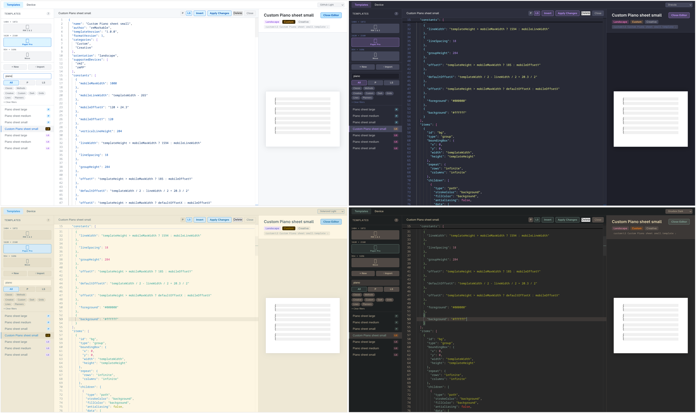
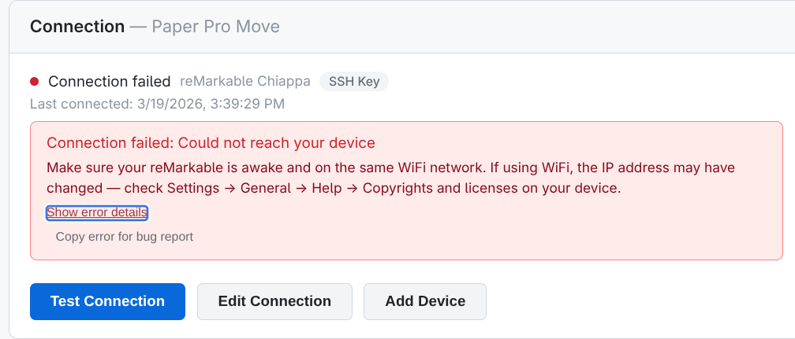

# remarkable-templates

[](https://github.com/cuttlefisch/RemarkableCustomTemplates/actions/workflows/ci.yml)
[](#)
[](LICENSE)
[](https://nodejs.org/)
[](https://support.remarkable.com/s/article/Software-release)

A browser-based template editor for reMarkable tablets. Browse, preview, create, and deploy custom page templates — no command line needed.


## Quick Start

```bash
git clone https://github.com/cuttlefisch/RemarkableCustomTemplates
cd remarkable_templates
docker compose up --build -d
```

Open **http://localhost:3000** in your browser. That's it.

> **Port conflict?** `PORT=3001 docker compose up --build -d`
> **Stop:** `docker compose down` · **Reset all data:** `docker compose down -v`

## What You Can Do

- **Browse & preview** all templates across reMarkable 1/2, Paper Pro, and Paper Pro Move resolutions
- **Create from scratch** or **fork any existing template** with a live SVG preview and JSON editor
- **Invert colors** for dark-mode templates — foreground/background swap with one click
- **Deploy to your devices** in the rm_methods format — templates sync across all paired devices via the reMarkable cloud
- **Manage multiple devices** — add several reMarkable tablets with independent sync status, deploy, and rollback
- **Check sync status** before deploying — see which templates are synced, local-only, or device-only
- **Selective deploy** — choose exactly which templates to push instead of deploying everything
- **Pull official templates** from your device to browse or use as a starting point
- **Back up & restore** your entire template collection as a ZIP, with merge preview and cleanup
- **One-click rollback** to the previous deploy or to pristine device state
- **10 built-in themes** — GitHub Light, Dracula, Nord, Gruvbox, and more

> **No reMarkable Connect subscription required.** rm_methods templates sync via the built-in cloud mechanism that ships with every reMarkable device. This works with or without a Connect subscription.

> [!WARNING]
> **Sync behavior is not guaranteed.** The rm_methods sync mechanism is reverse-engineered from observing how official reMarkable templates work. It is not documented or supported by reMarkable. Syncing behavior could change or break at any time with firmware updates. Always keep backups of your templates. See [How rm_methods sync works](docs/device-sync.md#how-rm_methods-sync-works) for details.

## Why Native Templates?

reMarkable supports two ways to add page templates: **native `.template` files** and **PDF templates**.

| | Native `.template` | PDF template |
|---|---|---|
| **Rendering** | Vector — drawn by xochitl's native renderer | Rasterized at fixed resolution |
| **Battery** | Minimal — lightweight vector paths | Higher — in manual testing, battery life is substantially shorter when using PDFs for pen and writing-intensive tasks |
| **Layout** | JSON-based with expressions and constants | Any layout tool that exports PDF |
| **Links & ToC** | Not supported | Supports inter-page linking and table of contents |

Native templates are ideal for grids, lined paper, planners, and any repeating geometric pattern. PDF templates are better for complex, non-repeating layouts or when you need clickable links and table of contents navigation.

This app focuses on native `.template` files — the format that gives you the best performance and cloud sync on reMarkable devices.


## Themes

10 built-in themes based on popular editor colorschemes — GitHub Light, One Dark, Dracula, Gruvbox, Nord, Solarized, Tokyo Night, and more. Theme selection persists across sessions.



## Device Setup


Navigate to the **Device & Sync** page in the app. The setup wizard handles SSH key generation, connection testing, and device configuration — all in your browser. You can manage multiple devices — each with its own connection, sync status, and deploy history.


**Multi-device users:** Pages render at the resolution of the device that created them — see [Page resolution and cross-device sync](docs/device-sync.md#page-resolution-and-cross-device-sync) for details.

For CLI workflows and manual SSH setup, see [Device Sync](docs/device-sync.md).

## Documentation

| Guide | Description |
|-------|-------------|
| [Quickstart](docs/quickstart.md) | Install to deploy in minutes |
| [Device Sync](docs/device-sync.md) | CLI workflows, SSH setup, rm_methods format internals |
| [Template Format](docs/template-format.md) | JSON format, expressions, device constants, repeat values |
| [Architecture](docs/architecture.md) | Project structure, data flow, key types, registry system |
| [Contributing](.github/CONTRIBUTING.md) | Dev setup, TDD workflow, PR checklist |

## Bug Reports

If you run into an error during device operations (connection, deploy, pull, rollback, etc.), the error dialog includes a **"Copy error for bug report"** button. Click it to copy formatted error details to your clipboard, then [open a GitHub issue](https://github.com/cuttlefisch/RemarkableCustomTemplates/issues/new) and paste the error info. Raw error details are also logged to the browser console (open with F12).



When reporting a bug, please include:
- The copied error details (or a screenshot)
- What you were trying to do
- Your reMarkable device model and firmware version
- Whether you're using Docker or native dev mode

## Native Development

To run without Docker (for contributing or hacking on the codebase):

```bash
pnpm install
pnpm dev        # Fastify + Vite dev servers on localhost:5173
```

See [CONTRIBUTING.md](.github/CONTRIBUTING.md) for the full dev workflow, testing, and PR checklist.

## License

[GPL v3](LICENSE)
