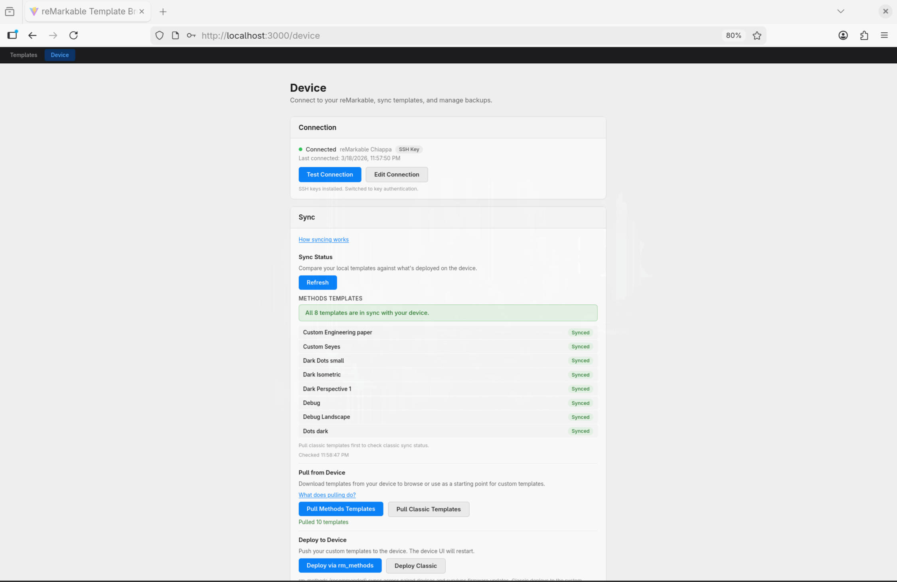

# remarkable-templates

[](https://github.com/cuttlefisch/RemarkableCustomTemplates/actions/workflows/ci.yml)
[](#)
[](LICENSE)
[](https://nodejs.org/)

A browser-based template editor for reMarkable tablets. Browse, preview, create, and deploy custom page templates — no command line needed.


## Quick Start

```bash
git clone https://github.com/cuttlefisch/RemarkableCustomTemplates
cd remarkable_templates
docker compose up --build -d
```

Open **http://localhost:3000** in your browser. That's it.

> **Port conflict?** `PORT=3001 docker compose up --build -d`
> **Stop:** `docker compose down` · **Reset all data:** `docker compose down -v`

## What You Can Do

- **Browse & preview** all templates across reMarkable 1/2, Paper Pro, and Paper Pro Move resolutions
- **Create from scratch** or **fork any existing template** with a live SVG preview and JSON editor
- **Deploy to your device** in the rm_methods format — templates sync across all paired devices via the reMarkable cloud
- **Pull official templates** from your device to browse or use as a starting point
- **Back up & restore** your entire template collection as a ZIP
- **One-click rollback** to the previous deploy or to pristine device state


## Device Setup




Navigate to the **Device & Sync** page in the app. The setup wizard handles SSH key generation, connection testing, and device configuration — all in your browser.

For CLI workflows and manual SSH setup, see [Device Sync](docs/device-sync.md).

## Documentation

| Guide | Description |
|-------|-------------|
| [Quickstart](docs/quickstart.md) | Install to deploy in minutes |
| [Device Sync](docs/device-sync.md) | CLI workflows, SSH setup, rm_methods format internals |
| [Template Format](docs/template-format.md) | JSON format, expressions, device constants, repeat values |
| [Architecture](docs/architecture.md) | Project structure, data flow, key types, registry system |
| [Contributing](.github/CONTRIBUTING.md) | Dev setup, TDD workflow, PR checklist |

## Native Development

To run without Docker (for contributing or hacking on the codebase):

```bash
pnpm install
pnpm dev        # Fastify + Vite dev servers on localhost:5173
```

See [CONTRIBUTING.md](.github/CONTRIBUTING.md) for the full dev workflow, testing, and PR checklist.

## License

[GPL v3](LICENSE)
