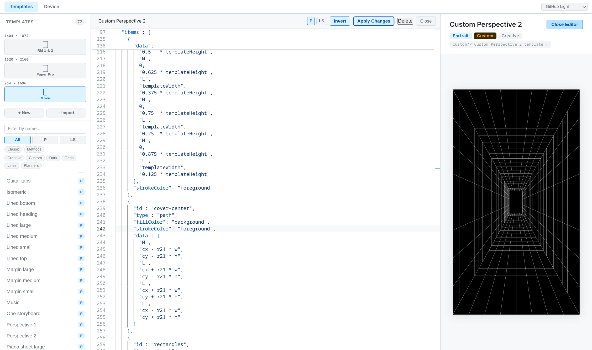
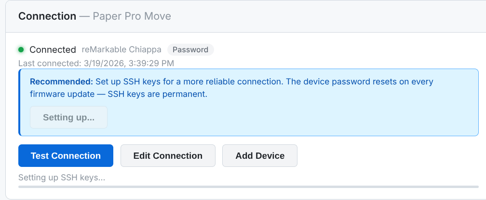
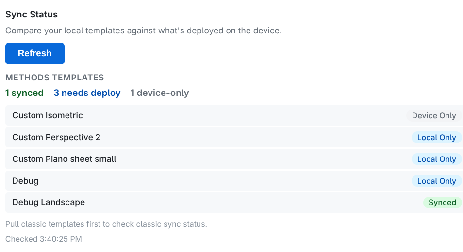
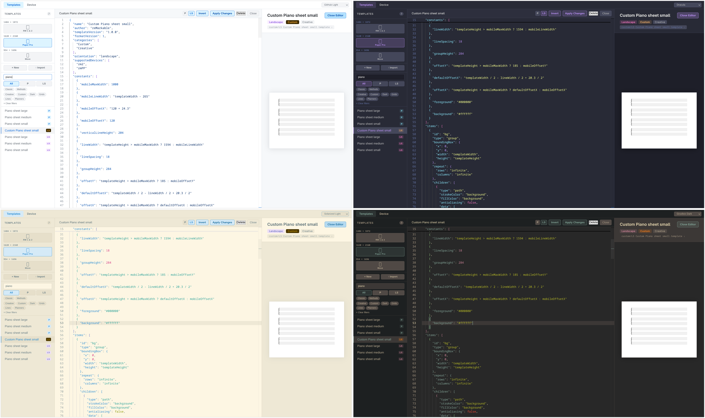
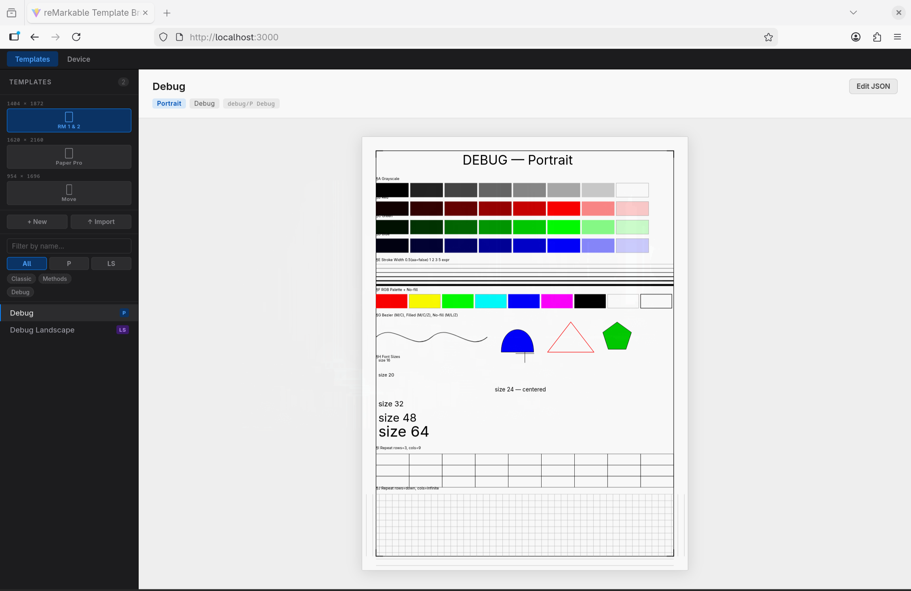
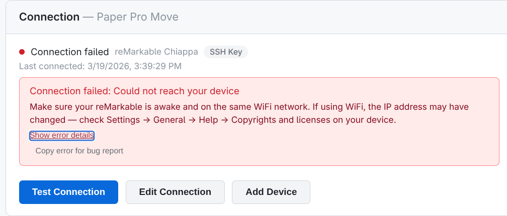

# remarkable-templates

[](https://github.com/cuttlefisch/RemarkableCustomTemplates/actions/workflows/ci.yml)
[](LICENSE)
[]()
[]()
[]()
[]()

Design, build, and deploy custom page templates for your reMarkable tablet.


## Install

Download the latest release for your platform:

**[Download from GitHub Releases](https://github.com/cuttlefisch/RemarkableCustomTemplates/releases/latest)**

| Platform | Format |
|----------|--------|
| Linux | AppImage, .deb, .rpm |
| macOS | .dmg |
| Windows | .exe |

Download, open, and you're ready to go. No terminal, no dependencies.

> **No reMarkable Connect subscription required.** rm_methods templates sync via the built-in cloud mechanism that ships with every reMarkable device. This works with or without a Connect subscription.

> [!WARNING]
> **Sync behavior is not guaranteed.** The rm_methods sync mechanism is reverse-engineered from observing how official reMarkable templates work. It is not documented or supported by reMarkable. Syncing behavior could change or break at any time with firmware updates. Always keep backups of your templates. See [How rm_methods sync works](docs/device-sync.md#how-rm_methods-sync-works) for details.

## Features

### Design Custom Templates

Create page templates from scratch with a visual drawing editor (7 shape tools including lines, polygons, circles, and bezier curves) or fine-tune with the built-in JSON editor. Fork any existing template as a starting point.




### Build Custom Notebooks

Combine multiple templates into multi-page notebooks and deploy them directly to your device.


### Manage Your Devices

Connect multiple reMarkable tablets (RM1, RM2, Paper Pro, Paper Pro Move), check sync status, and deploy templates via the cloud. Each device gets its own connection, sync status, and deploy history.






### Choose Your Theme

10 built-in themes based on popular editor colorschemes -- GitHub Light, One Dark, Dracula, Gruvbox, Nord, Solarized, Tokyo Night, and more. Your selection persists across sessions.




### Back Up & Restore

Export your entire template collection as a ZIP file. Restore anytime with merge preview -- see exactly what will be added or updated before confirming.


## Why Native Templates?

reMarkable supports two ways to add page templates: **native `.template` files** and **PDF templates**.

| | Native `.template` | PDF template |
|---|---|---|
| **Rendering** | Vector — drawn by xochitl's native renderer | Rasterized at fixed resolution |
| **Battery** | Minimal — lightweight vector paths | Higher — in manual testing, battery life is substantially shorter when using PDFs for pen and writing-intensive tasks |
| **Layout** | JSON-based with expressions and constants | Any layout tool that exports PDF |
| **Links & ToC** | Not supported | Supports inter-page linking and table of contents |

Native templates are ideal for grids, lined paper, planners, and any repeating geometric pattern. PDF templates are better for complex, non-repeating layouts or when you need clickable links and table of contents navigation.

This app focuses on native `.template` files — the format that gives you the best performance and cloud sync on reMarkable devices.

> [!NOTE]
> **macOS:** The app is not signed with an Apple Developer certificate. On first launch, right-click the app and choose **Open** (instead of double-clicking) to bypass the Gatekeeper warning. You only need to do this once.

<details>
<summary>Alternative: Run with Docker</summary>

```bash
docker compose up --build -d
```

Open **http://localhost:3000**. Stop: `docker compose down`. Reset all data: `docker compose down -v`.

> **Port conflict?** `PORT=3001 docker compose up --build -d`

</details>

### Upgrading

**Desktop app:** Download the new release and install over the existing version. Your data (templates, device config, SSH keys, notebooks) is stored in your OS app data directory and is preserved automatically. System templates (samples, debug) are updated to match the new version on each launch.

**Docker:** Pull the latest code and rebuild:

```bash
git pull origin main
docker compose up --build -d
```

> **Migrating between Desktop and Docker?** Use the Backup & Restore workflow on the Device & Sync page to move your data between the two.

## Device Setup

Navigate to the **Device & Sync** page in the app. The setup wizard walks you through SSH key generation, connection testing, and device configuration. You can manage multiple devices, each with independent sync status, selective deploy, and one-click rollback.



**Multi-device users:** Pages render at the resolution of the device that created them — see [Page resolution and cross-device sync](docs/device-sync.md#page-resolution-and-cross-device-sync) for details.

For SSH setup details and CLI workflows, see [Device Sync](docs/device-sync.md).

## Bug Reports

If you run into an error during device operations (connection, deploy, pull, rollback, etc.), the error dialog includes a **"Copy error for bug report"** button. Click it to copy formatted error details to your clipboard, then [open a GitHub issue](https://github.com/cuttlefisch/RemarkableCustomTemplates/issues/new) and paste the error info. Raw error details are also logged to the browser console (open with F12).



When reporting a bug, please include:
- The copied error details (or a screenshot)
- What you were trying to do
- Your reMarkable device model and firmware version
- Whether you're using the desktop app or Docker

## Documentation

| Guide | Description |
|-------|-------------|
| [Quickstart](docs/quickstart.md) | Install to deploy in minutes |
| [Device Sync](docs/device-sync.md) | SSH setup, rm_methods format, sync internals |
| [Template Format](docs/template-format.md) | JSON format, expressions, device constants, repeat values |
| [Notebook Format](docs/notebook-format.md) | On-disk notebook structure, cPages v2, per-device .rm strategy |
| [Data Architecture](docs/data-architecture.md) | Storage map, data stores, backup ZIP structure, API routes |
| [Architecture](docs/architecture.md) | Project structure, data flow, key types (for contributors) |
| [Contributing](.github/CONTRIBUTING.md) | Dev setup, TDD workflow, PR checklist |

<details>
<summary>Development</summary>

```bash
pnpm install
pnpm dev        # Fastify + Vite dev servers on localhost:5173
```

See [CONTRIBUTING.md](.github/CONTRIBUTING.md) for the full dev workflow, testing, and PR checklist.

</details>

## License

[GPL v3](LICENSE)
