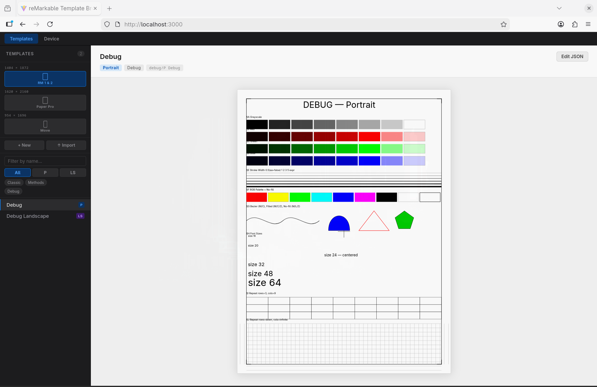
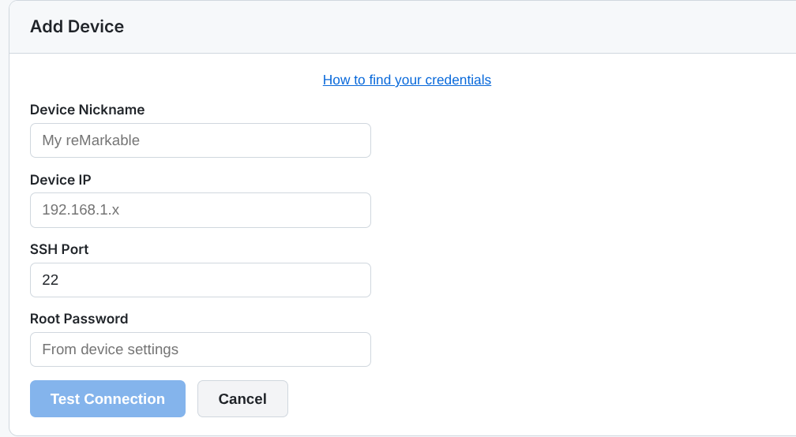
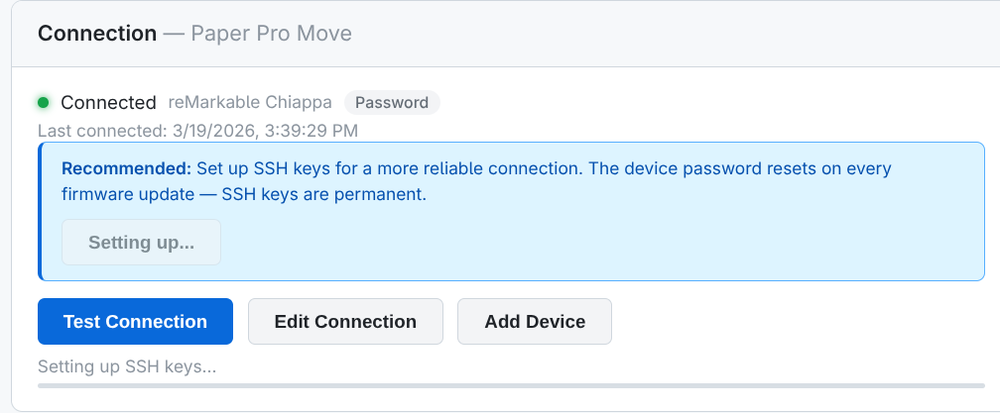
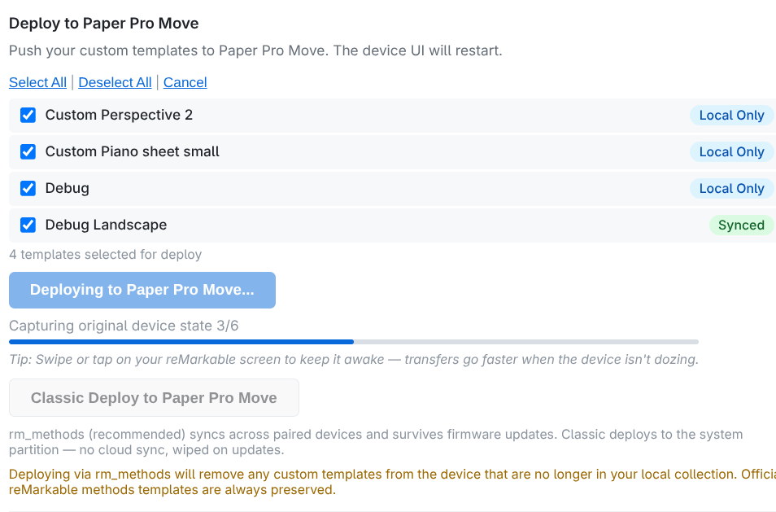
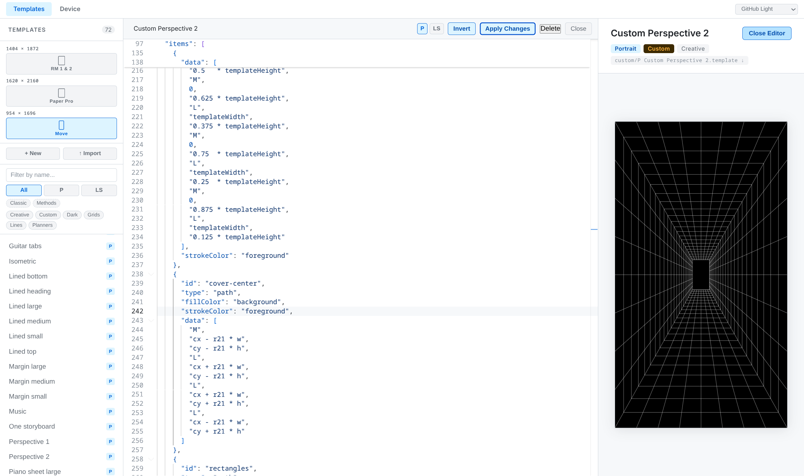
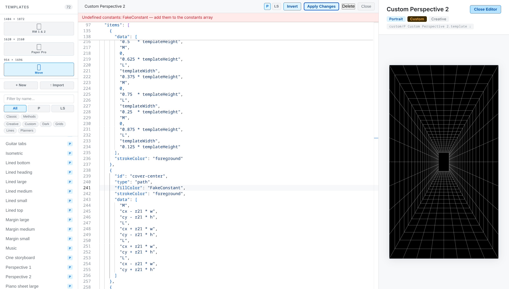
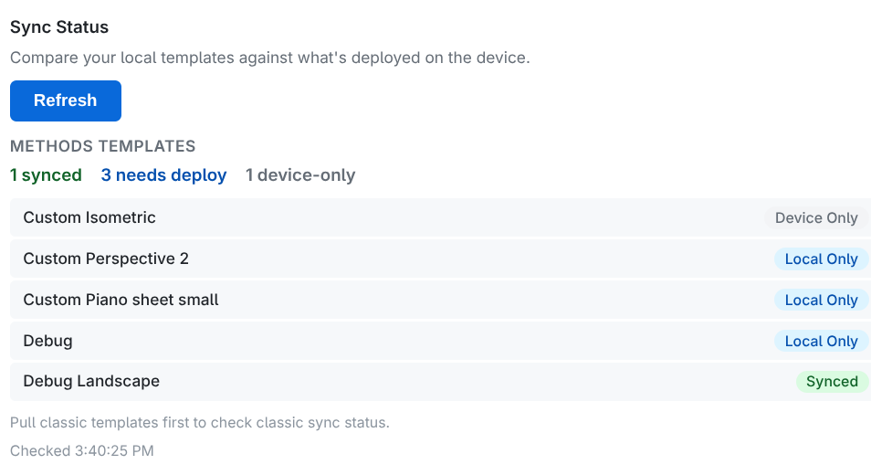
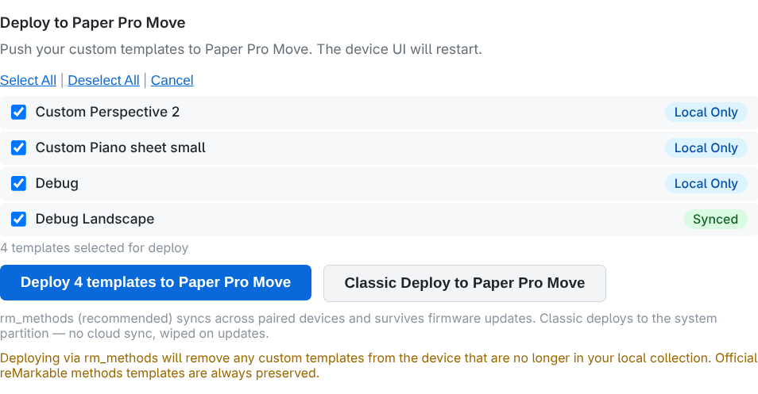
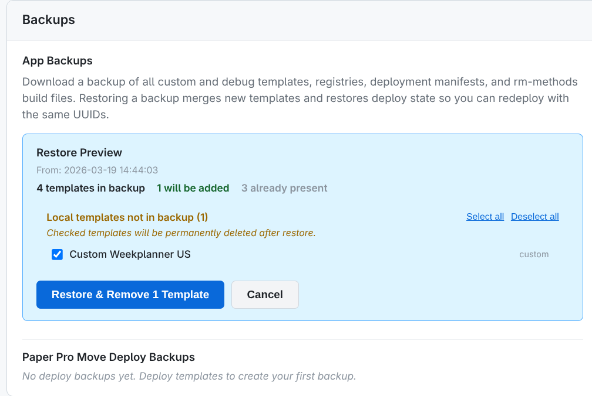

# Quickstart

Get remarkable-templates running and deploy custom templates to your reMarkable device.

## Prerequisites

- [Docker](https://docs.docker.com/get-docker/) and Docker Compose
- A reMarkable device on the same network (for device sync)

## 1. Start the app

```bash
git clone https://github.com/cuttlefisch/RemarkableCustomTemplates
cd remarkable_templates
docker compose up --build -d
```

Open `http://localhost:3000` in your browser.

> **Port conflict?** Use a different port: `PORT=3001 docker compose up --build -d`

## 2. Browse templates

The **Templates** page loads with a sidebar listing all available templates. Click any template to preview it on the SVG canvas. Use the filter chips to narrow by source (Classic / Methods), category, orientation, or name.



Toggle between device previews — **RM 1 & 2**, **Paper Pro**, and **Paper Pro Move** — to see how templates adapt to different screen sizes.

## 3. Connect your device

Navigate to the **Device & Sync** page. The setup wizard walks you through:

1. **SSH key generation** — creates a key pair in-browser
2. **Connection test** — verifies SSH access to your device
3. **Device configuration** — saves connection settings

You can add multiple devices — each gets its own connection, sync status, deploy history, and rollback state. Switch between devices using the tabs at the top of the page.



After connecting, you'll see your device info with connection status:



> **SSH over WLAN** must be enabled on the device. On newer devices (Paper Pro, Move), developer mode is required first — note that enabling developer mode triggers a factory reset. Find your device IP and SSH password under **Settings → Help → Copyrights and Licenses → GPLv3 Compliance**.

## 4. Pull templates from your device

On the **Device & Sync** page, click **Pull Methods Templates** to fetch official and custom rm_methods templates from the device. These appear as read-only entries in the sidebar — select one and click **Save as New Template** to fork it into an editable custom template.



## 5. Create or edit templates

- Click **New template** in the sidebar to start from scratch
- Or select any template and click **Save as New Template** to fork it
- Edit the JSON in the Monaco editor — the canvas updates live as you apply changes
- Click **Invert** to swap foreground/background colors for dark-mode templates
- Click **Apply** to validate; any undefined constant references are reported before rendering





## 6. Deploy to your device

On the **Device & Sync** page, click **Deploy**. You can check sync status first to see what needs deploying, and optionally select specific templates:





Templates are deployed in the rm_methods format, which means they **sync across all paired devices** via the reMarkable cloud.

> **No Connect subscription required.** rm_methods sync uses the built-in cloud mechanism that ships with every reMarkable — it works with or without a Connect subscription.

> [!WARNING]
> **Sync behavior is not guaranteed.** The rm_methods cloud sync mechanism is reverse-engineered and undocumented by reMarkable. It works as of firmware 3.x, but could change or stop working with any firmware update. Always keep local backups of your templates. See [How rm_methods sync works](device-sync.md#how-rm_methods-sync-works) for details.

Each deploy:
- Backs up the previous state automatically
- Cleans up any templates you've removed
- Restarts the device UI

> **Native vs PDF templates:** This app creates native `.template` files — vector-based pages that render instantly, use minimal battery, and zoom infinitely. PDF templates have their advantages (inter-page links, complex layouts) but are rasterized at fixed resolution and use more memory.

## 7. Back up your templates

Click **↓ Backup** on the **Device & Sync** page to download a ZIP of all your custom templates. This preserves UUIDs needed for device sync continuity.

To restore: click **↑ Restore** and select the backup ZIP. A preview shows what will be added, what's already present, and any local templates not in the backup that you can optionally clean up:



## 8. Rollback

If something goes wrong, use the **Device & Sync** page to roll back:

- **Rollback** — revert to the previous deploy
- **Rollback to original** — remove all custom templates (pristine state)

---

## Managing the app

**Stop:** `docker compose down`

**Data persistence:** Templates, device config, and SSH keys are stored in a Docker volume and persist across restarts.

**Start fresh:** `docker compose down -v` removes the volume and all data.

---

## For developers

To run natively without Docker (for contributing or development), see [CONTRIBUTING.md](../.github/CONTRIBUTING.md) and the [architecture docs](architecture.md).
